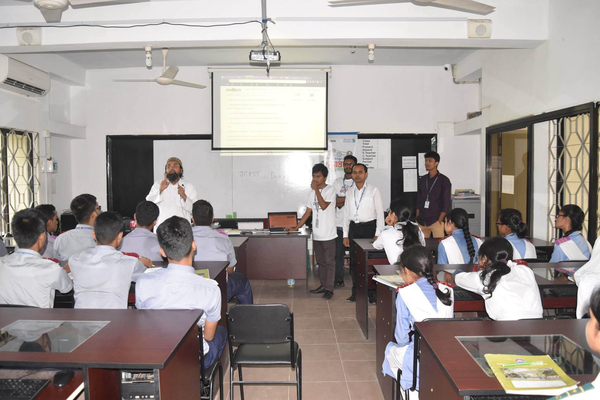

When I was working as trainer at [Bangladesh Open Source Network-BdOSN](https://www.bdosn.org/), I took workshops of the college students on preparing for the ISCPC-2019.

ISCPC 2019:
======
* Introduced about programming contest and ISCPC.
* Taught fundamentals of C programming, time complexity and how to write solution for problems.
* Demonstrated by solving and submitting problems along the consequences if the solution is accepted or not due to wrong solution, time limit etc.
* How to register and participate in the contest as a team.

